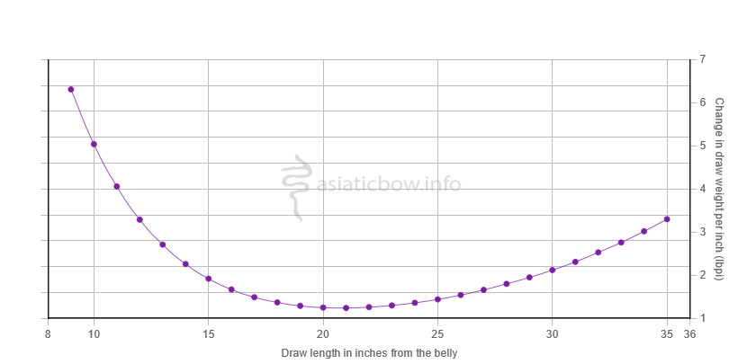

## Introduction

This will be the first in a series of posts on bows and their measurable characteristics, in particular with respect to Asiatic bows. All graphs from my website, [asiaticbow.info](https://asiaticbow.info) - check it out for more details :) 

In this post we'll be covering draw force curves and stacking curves. This will consist of a theoretical explanation of each one, along with a practical application. Later on we will make an extra post going more in depth into the mathematical aspects of these curves.

## Definitions

Let’s begin with some simple definitions. We will add them into the description to make referencing them easier. 
* Draw length: Distance that a bow is drawn, including the brace height, measured from the belly of the bow, in inches (see technical notes at the bottom of this post) 

* Poundage: Draw force, measured in pounds at a given draw length
* Stacking (State of being): When a bow’s draw force curve increases by more than 5.5% per inch (Taken from [Ronald’s video](https://www.youtube.com/watch?v=koJNVnFqX6I). We’ve chosen this 5.5% to make discussion easier, and you may or may not experience stacking at this point)
* Stack (verb): When a bow’s draw force curve changes by a large amount (Can be either increasing or decreasing by a large amount)

## Draw Force Curve: Theory 

First let’s go over a draw force curve. A draw force curve is the curve generated by measuring the poundage of a bow up to a given a draw length. You can create a draw force curve that goes up to any draw length (your bow may break if you try to measure very long draw lengths), but for the purposes of this post and for the data on [asiaticbow.info](https://asiaticbow.info), draw force curves will be measured between brace height (or as close as we can get to brace height) and the stated max draw length of the bow. 

In our case, we measure this poundage from the belly side of the bow, and we measure this at 1 inch intervals. We do a bunch of math to smooth those points out, and we get a nice curve like this! Note that the vertical axis is the poundage of the bow in pounds, and the horizontal axis is the draw length of the bow in inches. 

The draw force curve can be split up into roughly 3 sections 
* Preload region
* Linear region
* Stacking region

Preload region is where the siyahs have mechanical advantage, giving you a lot of energy per inch.

Linear region is the region in which the bow is linear, and gives you a linear amount of energy per inch.

Stacking region is where the draw force curve becomes exponential and you start to not really get much energy per inch.

Note: The lines in this image are approximate. We haven't come up with the most precise way to calculate where these regions begin and end yet, but the  idea should be pretty clear here.

## Draw Force Curve: Application 

So what does this actually tell us? Well, the area under the draw force curve tells us the total energy stored in the bow. This lets us directly compare total energy stored by a bow. 

For example, looking at these two bows, let's pick the point 30 inches. With the help of some math, we would be able to see that the dark blue curve stores 116.61J of energy at 30 inches, while the light blue curve stores 111.99J of energy at 30 inches. We might be able to intuit this as well by claiming that the area under the dark blue curve is equal to the area of the light blue curve, plus a little bit more, so the dark blue curve must store more energy.

**Important note**: I’m going to put this out here because I know that I’m going to get people trying to say this, but more energy stored does _not_ make a bow better. It just means that the bow is able to store more energy. This does _not_ tell us anything about how efficiently it uses that energy (i.e, how efficiently it transfers the energy into an arrow), nor does it tell us anything about how the bow itself will behave (i.e, how much handshock it has, or it's ability to shoot an arrow of a certain weight). 

## Stacking Curve: Theory 
The stacking curve is the derivative of the draw force curve. What this means is that it’s a measurement of how fast the draw force curve is changing - it measures how many pounds a bow increases or decreases per inch drawn between two points. 

Note that the shape of this curve is similar to an up-facing parabola for most bows - during the preload region of a bow’s draw force curve, the bow has a lot of negative stack, i.e, the change in the amount of force needed to pull a bow is rapidly decreasing, due to “using up” the preload of the bow’s geometry, so the stacking curve has to go down

When we get into the linear region, the bow’s lbpi change remains fairly constant - as, it is, a linear region, creating a fairly flat region

Finally, we enter into the stacking region where we once more see the draw force curve rapidly changing, where it goes up really fast.

Let’s show an example of reading this curve. On this stacking curve, between 25 inches (3.4 lbpi) and 30 inches (6.19lbpi) on this bow, the stacking curve changes by 3lbpi, meaning that we would percieve pulling the bow at 30" to be (approximately) twice as hard!

## Stacking Curve: Application
What does this curve actually tell us? This curve lets us know how a bow actually feels like to draw - the higher the value of the stacking curve at a given draw length, the harder that it will feel to pull the bow, as you’re moving a larger poundage per inch

In this example, we see that the lbpi is pretty constant, which most people would perceive as being a “linear”, or a “smooth” bow. 

If we convert the absolute value of lbpi into a percentage of the peak poundage of the bow instead, we can get a percentage value of how much the draw force increases at that point. Most people seem to perceive stacking as beginning at around 5.5% increase in draw weight per inch. 

I’m also going to point out now that whether or not a bow stacks at a given draw length or not is not necessarily a bad thing - all that it means is that the bow’s draw weight is going to start to change rapidly at that draw length. Some people prefer stack in their bows at or near their draw length, due to it acting as a “wall” to pull against, letting them know when to release. Some people like linear bows. 

Thank you for reading. Hopefully I’ll make the next post sometime soon. 

## Technical Notes 
1. Draw force curves on my website are generated by measuring draw length from the belly to “wherever the hook hooks”. Sometimes this is the centre of the bow, and sometimes this is where your finger/thumb/whatever would actually be when you’re pulling back the bow. There is about a 1-2lb difference when we measure between these positions. It’s fairly negligible, but yes, this is a technical difference. 

2. Our draw force curves are measured to the BELLY of the bow. Some manufacturers measure to the BACK of the bow instead, because you usually measure your draw length to the back of the bow. There is usually about a 1 inch delta between these two measurements. I.e, 27” from the belly is usually about 28” from the back. There are exceptions where some bows are just… really thick, but for the most part, this holds true. 

